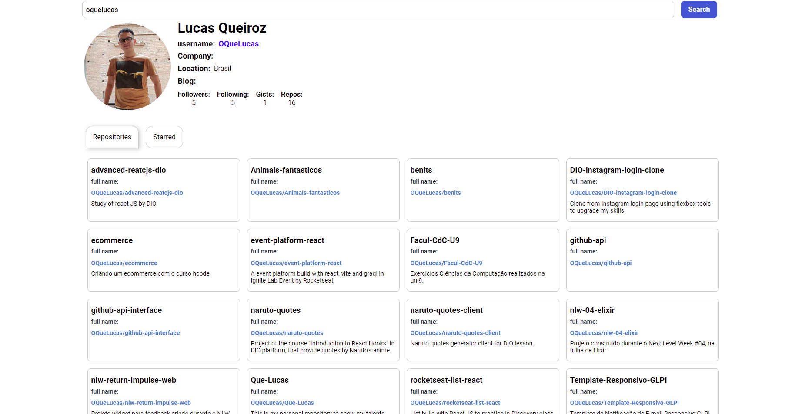

# About project

This repository was created in order to show how can create a frontend application with reusable components.

This application use the github public api.

## Features

- Search infos by username
- Search repo by username
- Search starred by username

## Preview

Print of the finished project.

## Libraries used

- [axios](https://www.npmjs.com/package/axios)
- [react-tabs](https://www.npmjs.com/package/react-tabs)
- [styled-components](https://styled-components.com/)